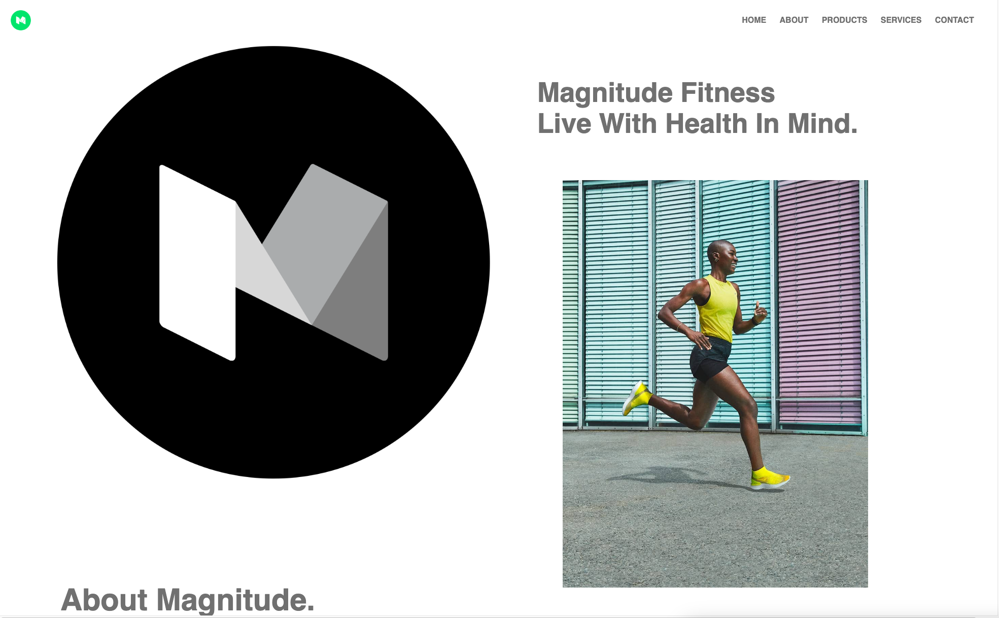

# Design Understanding & Links

## My idea for this design was inspired my similar trending modern designs

- ### The navigation is pretty straightforward. The target market for this design and brand is a simple fitness company that owns all of it's own products including gyms, fitness app, and tracking watch. I choose the color scheme because I believe it is more aimed toward a younger audience. Not to say that people that are past 40 are old. However, there area a large amount of younger people looking for a fitness brand like "Magnitude".

- ### Because the brand is targeted towards younger people, I went with a modern design that I believe sort of also targets the same audience. The color scheme is also something I believe to be more favored by the same audience.

## Here are some things I added in correlation with common ui/ux practices

- Bleeding images into the next section to get the user to keep scrolling
- Brighter color to attract customers to that element
- There is no cart. My idea behind this was to seeing all services and products before purchasing just one. This in the grand scheme of things isn't the best idea without some sort of alerts or other sections to encourage them to purchase all.
- The overall design is sort of a two column structure with headers to show the user where to start.
- I added large images of athletes and a very nice gym to hopefully encourage the user to want to be like the athlete or want to be in the gym.

- [web 4 site](https://in-info-web4.informatics.iupui.edu/~garizola/portfolioN299/)
- [xd File](https://xd.adobe.com/view/1808ee51-dafd-4f02-926f-b461dd353bf4-4d5b/)
